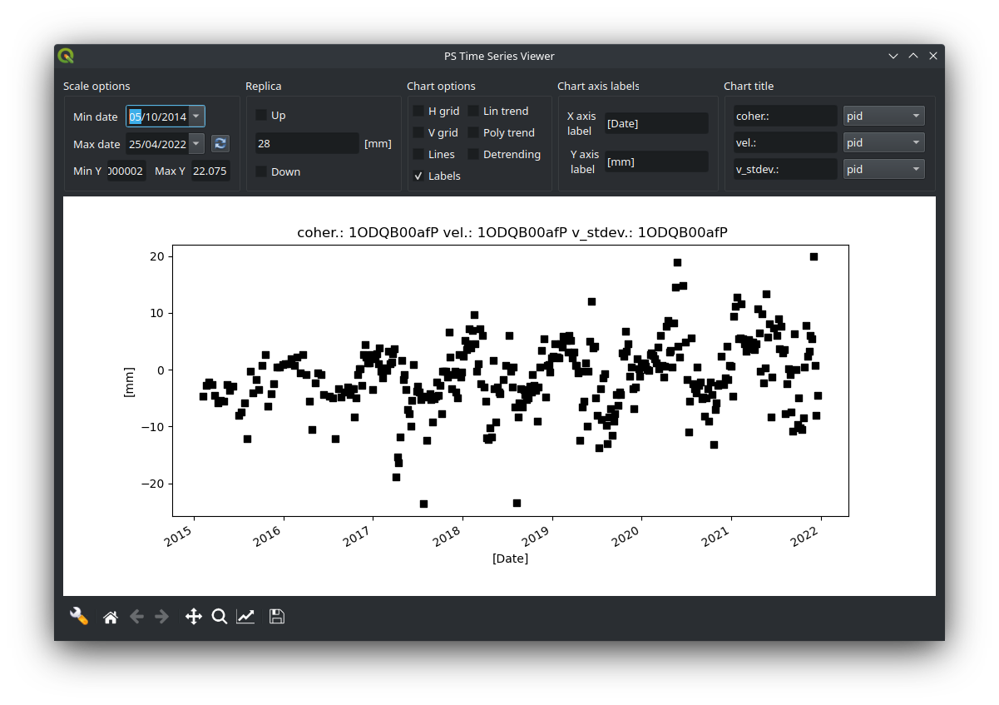
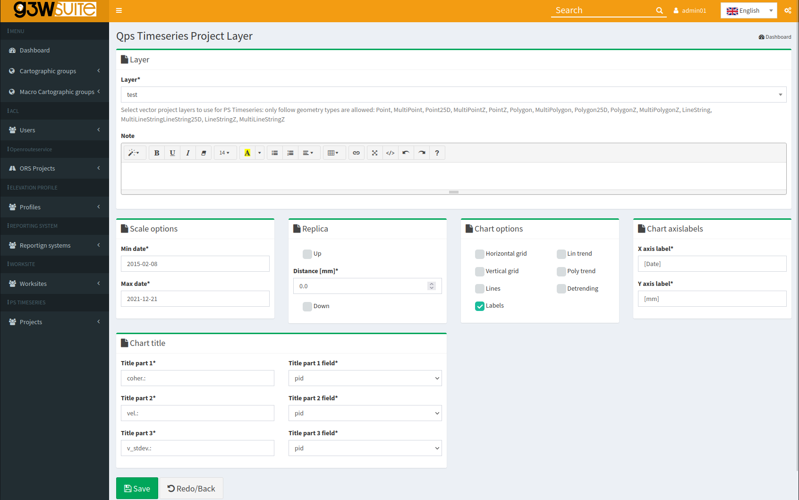

# G3W-ADMIN-QPROCESSING v1.0.0-beta.3

Porting on G3W-SUITE of QGIS desktop plugin https://plugins.qgis.org/plugins/pstimeseries/



On G3W-SUITE:




## Installation

Install *qps_timeseries* module into [`g3w-admin`](https://github.com/g3w-suite/g3w-admin/tree/v.3.7.x/g3w-admin) applications folder:

```sh
# Install module from github (v1.0.0)
pip3 install git+https://github.com/g3w-suite/g3w-admin-ps-timeseries.git@v1.0.0

# Install module from github (dev branch)
# pip3 install git+https://github.com/g3w-suite/g3w-admin-ps-timeseries.git@dev

# Install module from local folder (git development)
# pip3 install -e /g3w-admin/plugins/qps_timeseries

# Install module from PyPi (not yet available)
# pip3 install g3w-admin-qps-timeseries
```

Enable `'qps_timeseries'` module adding it to `G3W_LOCAL_MORE_APPS` list:

```py
# local_settings.py

G3WADMIN_LOCAL_MORE_APPS = [
    ...
    'qps_timeseries'
    ...
]
```

### Docker
Refer to [g3w-suite-docker](https://github.com/g3w-suite/g3w-suite-docker) repository for more info about running this on a docker instance.

**NB** On Ubuntu Jammy you could get an `UNKNOWN` package install instead of `g3w-admin-ps-timseries`, you can retry installing it as follows to fix it:

```sh
# Fix: https://github.com/pypa/setuptools/issues/3269#issuecomment-1254507377
export DEB_PYTHON_INSTALL_LAYOUT=deb_system

# And then install again the module
pip3 install ...
```
Add the above lines to your `scripts/setup.sh` file.

## Sample data

The [qps_timeseries.qgs](qps_timeseries/tests/data/projects/qps_timeseries.qgs) project is available in the [tests](qps_timeseries/tests/data/) folder (EPSG:4326).
